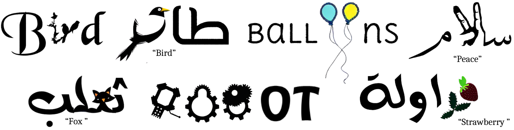
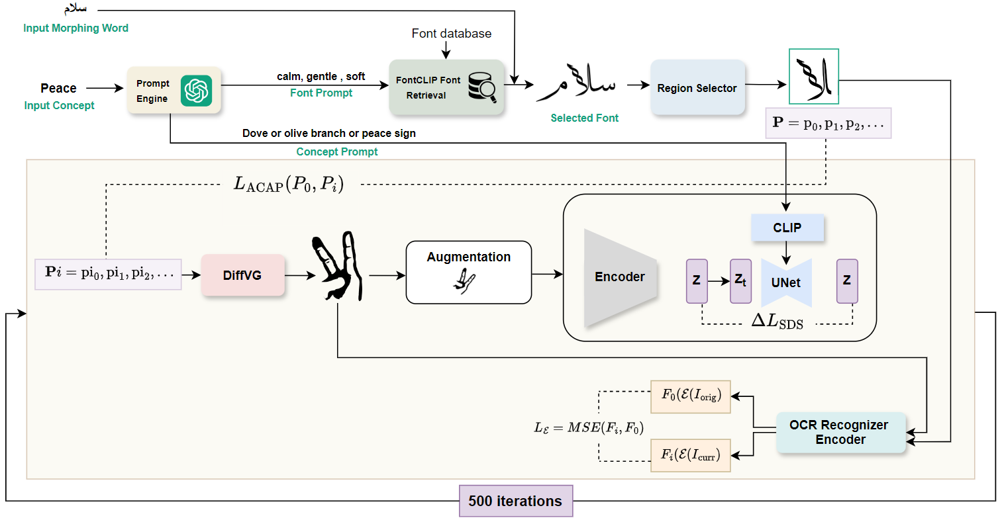
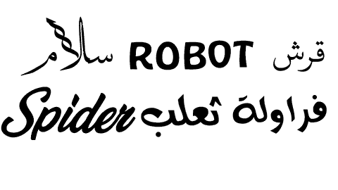
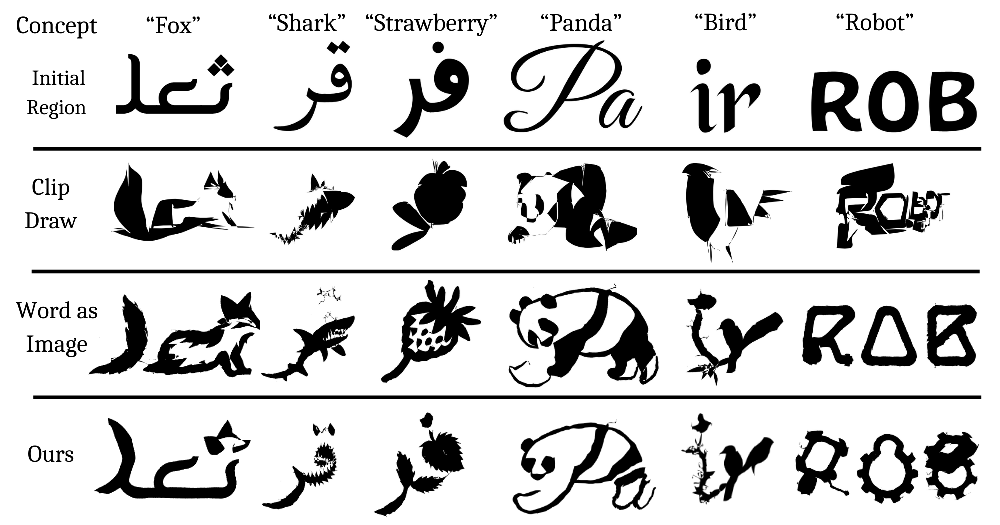

# Khattat: Enhancing Readability and Concept Representation of Semantic Typography

AI4VA @ ECCV 2024

[Project page](https://ai091.github.io/Khattat-page/) ·
[arXiv](https://arxiv.org/abs/2410.03748) ·
[Poster](https://drive.google.com/file/d/1KX6sz8ZktmFYDxcDZwmZQ4tzwWiHDbSz/view?usp=sharing)



*Examples of semantic typography generated by Khattat in Arabic and English.
Coloured examples are post-processed with Stable Diffusion's depth-to-image
method.*

## Abstract

Designing expressive typography that visually conveys a word's meaning while
maintaining readability is a complex task, known as semantic typography. It
involves selecting an idea, choosing an appropriate font, and balancing
creativity with legibility. We introduce an end-to-end system that automates
this process. First, a Large Language Model (LLM) generates imagery ideas for
the word, useful for abstract concepts like "freedom". Then, the FontCLIP
pre-trained model automatically selects a suitable font based on its semantic
understanding of font attributes. The system identifies optimal regions of the
word for morphing and iteratively transforms them using a pre-trained diffusion
model. A key feature is our OCR-based loss function, which enhances readability
and enables simultaneous stylization of multiple characters. We compare our
method with other baselines, demonstrating great readability enhancement and
versatility across multiple languages and writing scripts.

## Method



The system first uses a prompt engine to get concrete concept and font prompts.
It then selects an appropriate font with FontCLIP and identifies the region fit
for the concept prompt. Over 500 iterations, it deforms the letter outlines to
align with the concept, while regularizing loss terms maintain readability and
minimize distortions.



## Results

|  | OCR accuracy | Readability rank ↓ | Visual appeal rank ↓ |
|---|---|---|---|
| **Ours (ar)** | **0.64** | **1.34** | 1.71 |
| Word-as-Image (ar) | 0.35 | 1.87 | **1.68** |
| CLIPDraw (ar) | 0.20 | 2.79 | 2.61 |
| **Ours (en)** | **0.78** | **1.35** | 1.75 |
| Word-as-Image (en) | 0.62 | 1.78 | **1.71** |
| CLIPDraw (en) | 0.26 | 2.87 | 2.54 |

Ranks come from a human study with 74 participants. The OCR loss keeps
multi-letter stylizations readable:



## Installation

Requires Linux, an NVIDIA GPU with 8 GB or more, the CUDA toolkit, [uv](https://docs.astral.sh/uv/)
and [just](https://just.systems).

```bash
git clone --recursive https://github.com/AI091/Khattat && cd Khattat
just torch=cu130 setup   # or cu128 / cpu
```

`setup` installs the locked dependencies, builds [diffvg](https://github.com/BachiLi/diffvg)
against your CUDA toolkit, and checks every component. Model weights (about 7 GB)
download on first use.

## Usage

```bash
uv run khattat run freedom                         # fully automatic
uv run khattat run حرية --concept freedom          # non-Latin words take an English concept
uv run khattat run bird --region 1 3 --font F.ttf  # fix the region or font
uv run khattat morph BIRD --concept bird --font F.ttf --region 1 3 --no-ocr
uv run khattat colorize runs/<run>/region_output.png --concept bird
```

Each run writes an SVG of the word, PNGs, the loss history and a `run.json`
with every choice made. Regions are character ranges with an exclusive end.

The prompt engine runs locally or through a hosted API, set with `KHATTAT_LLM`:

| Value | Backend |
|---|---|
| `ollama:<model>` | Ollama, default `qwen3.5:2b` |
| `hf:<repo>` | transformers in-process, default `Qwen/Qwen3-1.7B` |
| `gemini:<model>` | Gemini API with `GEMINI_API_KEY`, default `gemini-flash-latest` |
| `anthropic:<model>` | Anthropic API with `ANTHROPIC_API_KEY` |

By default it uses Ollama when the daemon is running and the in-process model
otherwise.

## Evaluation

```bash
just eval   # Khattat vs Word-as-Image on assets/eval_words.tsv
uv run khattat evaluate runs/eval/*/*/
```

Both methods run on the same font and region per word. Readability is measured
with Surya OCR accuracy and semantics with CLIPScore.

## Development

```bash
just fmt     # format and autofix
just check   # lint and type check, as in CI
```

## Citation

```bibtex
@inproceedings{hussein2025khattat,
  author    = {Hussein, Ahmed and Elsetohy, Alaa and Hadhoud, Sama and Bakr, Tameem and Rohaim, Yasser and AlKhamissi, Badr},
  title     = {Khattat: Enhancing Readability and Concept Representation of Semantic Typography},
  booktitle = {Computer Vision -- ECCV 2024 Workshops},
  pages     = {278--295},
  publisher = {Springer},
  year      = {2025},
  doi       = {10.1007/978-3-031-92808-6_18},
}
```

## License

MIT. diffvg is Apache-2.0. Surya's model weights use a modified OpenRAIL-M
license.
